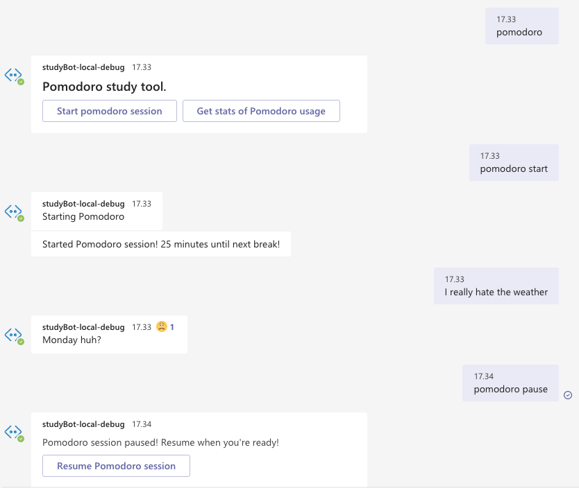

# StudyBot

## Example of conversation



## Installation 
### Prerequisites:
* Git - [Download & Install Git](https://git-scm.com/downloads)
* Node.js - [Download & Install Node.js](https://nodejs.org/en/download/)

## Running the bot
### Debug locally
1. Download the latest stable release of [BotFramework-Emulator](https://github.com/microsoft/BotFramework-Emulator/releases)
2. Build the bot by running `npm run build`
3. Run the bot by running `npm run start`
4. Connect to the bot via Bot Framework-Emulator by pointing to the URL http://localhost:3978

Note: `whoami` will not work as you're not logged in to the Teams application.

### Use directly in Teams
1. Install the [teamsfx](https://www.npmjs.com/package/@microsoft/teamsfx) CLI made by Microsoft by running the command: ```npm install -g @microsoft/teamsfx-cli```
2. Make a new application via the commandline, and simply replace the `bot` folder with the one in this repository.
3. Run `teamsfx provision` to sync with your Azure account.
4. Now we can debug the bot locally, by using the command: `teamsfx preview`. You'll be prompted by a login to your Microsoft account
5. Finally, `teamsfx deploy` can deploy the Bot to Azure.

## Dialogue
The bot uses [node-nlp](https://www.npmjs.com/package/node-nlp) to detect what topic the user is talking about and detect sentiment.

## Commands
* `intro`: Introduction prompt
* `whoami`: Fetch details about the current user 
### Pomodoro
The bot has a built-in Pomodoro app to help you study! The following commands are supported: 
* `pomodoro`: Pomodoro prompt
* `pomodoro start`: Start Pomodoro session
* `pomodoro pause`: Pause the current session
* `pomodoro resume`: Resume the current session
* `pomodoro stats`: Get an overview of the # of sessions completed

### Sourdough (TODO)
We all know that it can be troublesome to remind ourselves of the many steps in the process of baking a sourdough bread. That's why this bot also helps you with this!

The bot will remind you, via Teams, when the next step of the process is due!

* `sourdough feed`
* `sourdough autolyse`
* `sourdough mix`
